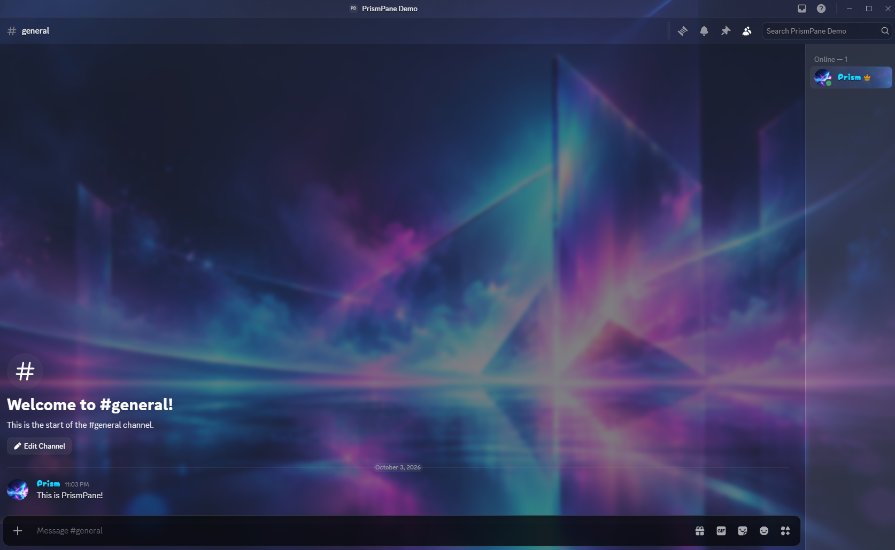
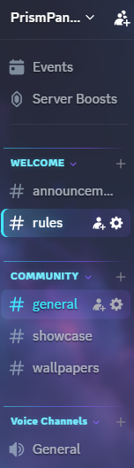
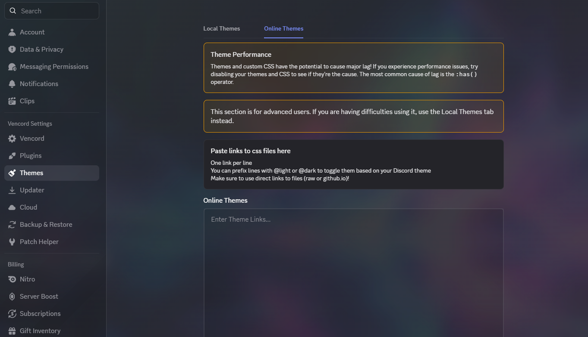

# PrismPane

A wallpaper-first frosted glass Discord theme by **PixelFF**.

PrismPane is designed around translucent panels, clean readability, and the PixelFF cyan / blue / purple / magenta accent palette.

It works on its own with a hosted default wallpaper, or can be paired with **PrismPick** to browse and switch wallpapers directly from Vencord.

---

## Download

[Download the latest PrismPane release](https://github.com/PixelFFHQ/PrismPane/releases/latest)

Install `PrismPane.theme.css` through Vencord's Themes settings.

---

## Features

- Frosted glass-style Discord interface
- Built-in default wallpaper
- Custom wallpaper support
- Designed to pair with PrismPick
- Cyan, blue, purple, and magenta PixelFF accent system
- Custom server and channel indicators
- Compact channel and member lists
- Styled Discord settings
- Styled voice connection controls
- Improved readability over detailed wallpapers
- PixelFF titlebar branding
- Reduced-motion support for animated accents

---

## Installation

### Vencord

1. Download `PrismPane.theme.css`.
2. Open Discord.
3. Go to:

   **Settings → Vencord → Themes**

4. Open your Vencord themes folder.
5. Place `PrismPane.theme.css` inside.
6. Return to Discord and enable **PrismPane**.

PrismPane includes a default wallpaper and works without PrismPick.

---

## PrismPick

For wallpaper browsing and switching directly inside Discord, PrismPane is designed to pair with:

**PrismPick by PixelFF**

PrismPick can load wallpapers from the official PixelFF wallpaper library or from a custom GitHub-hosted image library.

PrismPick is optional. PrismPane remains fully usable without it.

---

## Wallpaper Support

PrismPane uses:

```css
--background-image-url
```

The included default wallpaper is loaded automatically.

PrismPick can override this variable whenever another wallpaper is selected.

You can also manually replace the value inside the theme:

```css
--background-image-url: url("YOUR-IMAGE-URL");
```

---

## Customization

PrismPane exposes several variables near the top of the theme file.

### Wallpaper

```css
--pixelff-bg-size: cover;
--pixelff-bg-position: center;
--pixelff-bg-repeat: no-repeat;
--pixelff-bg-dim: 0.08;
```

### PixelFF Colors

```css
--pixelff-cyan: #41e6ff;
--pixelff-blue: #4f7cff;
--pixelff-purple: #8b5cff;
--pixelff-magenta: #ff4fd8;
```

### User Panel Text

```css
--pixelff-user-name-size: 18px;
--pixelff-user-status-size: 15px;
```

---

## Default Wallpaper

The default PrismPane wallpaper is hosted through the official PixelFF PrismPick wallpaper library:

**PixelFFHQ / PrismPick-Wallpapers**

Additional wallpapers can be selected through PrismPick.

---

## Compatibility

PrismPane is designed for current Discord builds using Vencord.

Discord frequently changes internal class names. Some visual elements may require updates after major Discord UI changes.

If something suddenly looks incorrect after a Discord update, please open an issue in this repository.

---

## Screenshots

### Server View



### Channel Styling



### Settings



---

## Related Projects

### [PrismPick](https://github.com/PixelFFHQ/PrismPick)

The companion Vencord wallpaper picker for PrismPane.

### [PrismPick-Wallpapers](https://github.com/PixelFFHQ/PrismPick-Wallpapers)

The official default wallpaper library used by PrismPick and PrismPane.

---

## License

PrismPick is licensed under the **Mozilla Public License 2.0**.

See the [`LICENSE`](LICENSE) file for the full license text.

---

## Branding

The MPL-2.0 license applies to the PrismPane source/theme files, not to the PixelFF, PrismPane, or PrismPick names,
logos, or associated branding.

Forks and modified versions may identify themselves as being based on PrismPane, but must not represent themselves as
official PixelFF releases.

Original copyright and license notices must remain intact.

---

## About PixelFF

PrismPane is developed by **PixelFF**.

Built by **Hush / PixelFF**.
